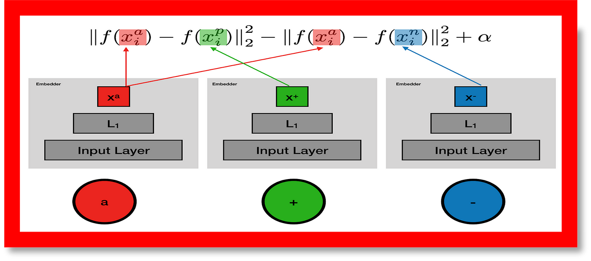

# COMSYS-Hackathon-5-2025
###  Task B: Face Verification
- **Objective:** 
    Build a **face verification system** that reliably matches distorted face images to their correct identities using metric learning, without relying on traditional classification approaches.

### 🌟 Key Challenges
- ✅ Handle **various distortions** (blur, noise, occlusions) in input images  
- ✅ Generalize to **unseen identities** during inference  
- ✅ Maintain high accuracy despite **low-quality references**  
- **Dataset Structure:**
```
Project/
│
├── Comys_Hackathon5/Task_B/
│   ├── train/
│   │   ├── ....jpg
│   │   └── ...
│   ├── val/
│       ├── ....jpg
│       └── ...        
├── models/
│   ├── Embedding_Seq.h5
│   └── TripletNetwork.h5
│
├── results/
│   ├── model_result.txt
│   └── model_graph.png
│
├── scripts/
│   ├── 01_triplet_network.py
│   ├── 02_embedding_model.py
│   └── 03_match_face.py
│
├── README.md
└── .gitattributes
```

 **Model Goal**
- Learn a similarity-based system that embeds faces such that:
- Similar identities are **close in embedding space**
- Dissimilar faces are **far apart**

## 🧠 Model Description: Triplet Network with a ResNet50 backbone for Face Verification

Triplet Network with a ResNet50 backbone for learning embeddings that minimize intra-class distances (pull similar samples closer) and maximize inter-class distances (push dissimilar samples apart). Triplet loss is a way to teach a machine-learning model how to recognize the similarity or differences between items. It uses groups of three items, called triplets, which consist of an anchor item, a similar item (positive), and a dissimilar item (negative). The goal is to make the model understand that the anchor is closer to the positive than the negative item. This helps the model distinguish between similar and dissimilar items more effectively.

<div align="center">
  
</div>

**Triplet Loss Implementation**

The standard triplet loss with a margin α:

<div align="center">
  
  <p>Triplet Loss Architecture for Face Embedding Learning</p>
</div>

**Anchor (xa):** The reference image (red).

**Positive (x⁺):** A similar image of the same identity (green).

**Negative (x⁻):** An image of a different identity (blue).

### 🔍 **Why Triplet Loss?**


- ✔ **Handles Large Classes:**: Works well when there are thousands/millions of identities (e.g., in face recognition, where each person is a class).  
- ✔ **Focuses on Relative Similarity:**: Enforces that a face is closer to all other faces of the same person than to any face of a different person.  
- ✔ **Metric Learning**:  It directly optimizes the ["embedding space for distance-based comparisons "](https://www.researchgate.net/publication/357529033_Triplet_Loss)(unlike softmax classification).  


### 🔍 Why ResNet50?

- ✔ **Strong Feature Extraction**: Its deep residual layers capture hierarchical facial features (edges → textures → parts → whole face).  
- ✔ **Pretrained Advantage**: Pretrained on ImageNet, it already understands generic visual features, speeding up convergence.  
- ✔ **Balance of Speed and Accuracy**: Deeper than ["ResNet18"](https://www.researchgate.net/publication/348248500_ResNet_50) but more efficient than ResNet152, making it practical for deployment
 

### 🔍 How They Work Together

- ✔ **Input**: Three face images (anchor, positive, negative). 
- ✔ **ResNet50**:  Extracts features for each face.  
- ✔ **Embedding Layer**:  Maps features to a low-dimensional space (e.g., 128-D).  
- ✔ **Triplet Loss**:Computes distances and updates the model to satisfy:d(A,P)+α<d(A,N)
                       where : α is a margin (e.g., 0.2). 

### 🛠 Core Architecture
The twin networks (CNNs) encode input face images into high-dimensional embedding vectors using a shared backbone.These embeddings are then compared using Euclidean distance to determine similarity:
<div align="center">
  
  <p>Metric learning with Triplet Loss: Embeddings from shared-weight CNNs are adjusted to cluster similar (anchor/positive) and separate dissimilar (anchor/negative) samples</p>
  
</div>

### 🔄 Verification Workflow
# 1. Preprocessing
- Input: Two face images (Image A and Image B)
- Steps:
  - Face detection & alignment (MTCNN recommended)
  - Resize to `224×224` (ResNet standard input)
  - Normalize pixel values

# 2. Feature Extraction
```python
# Pseudocode
embedding_a = resnet50(Image_A)  
embedding_b = resnet50(Image_B)  

1. Two face images are passed through the **Triplet Network**.
2. Each branch (with shared weights) generates a **feature embedding**.
3. A **distance metric** (e.g., *Euclidean distance*) computes the similarity between embeddings.
4. The result is compared against a predefined **threshold**:
   - If **distance < threshold** → ✅ *Same Person*
   - If **distance ≥ threshold** → ❌ *Different Person*
```
### 🖼️ Visualizing Training Triplets

Below is a sample visualization of the triplet structure used in training the Triplet Network:


- **Anchor**: The reference face image.
- **Positive**: A different image of the *same person* as the anchor.
- **Negative**: An image of a *different person* from the anchor.

This setup enables the model to learn embeddings where:
- Distance(anchor, positive) → **small**
- Distance(anchor, negative) → **large**

Such training ensures that the model can effectively distinguish between similar and dissimilar faces using a distance threshold.

### ⚙️ Model Specifications
| Parameter          | Value                          |
|--------------------|--------------------------------|
| Input Size         | 100×100 RGB                    |
| Base Model         | Custom CNN (4 Conv Blocks)     |
| Embedding Size     | 4096-D (sigmoid-activated)     |
| Loss Function      | Contrastive Loss               |
| Distance Metric    | Euclidean Distance             |

### 🏆📈  Performance Metrics
| Metric                   | Value  |
|--------------------------|--------|
| Test Accuracy            | ~97%   |
| precision                | 0.9729 |
| Recall                   | 0.9841 |
| F1-Score                 |0.9785  |
|Threshold                 |0.945   |

  ✅ Our trained Triplet Network with a ResNet50 backbone achieved an impressive ~97% verification accuracy on the validation/test set.

> 📌 Note: This high accuracy underscores the effectiveness of Triplet Networks in face verification tasks, especially when using embedding-based similarity with well-curated datasets.
> 
## 🤝 Acknowledgements

Developed by [AI-dentifiers](https://github.com/khushi04-sharma/Comys_Hackathon5_2025_Task_B) and contributor.  
For academic/educational use only.


