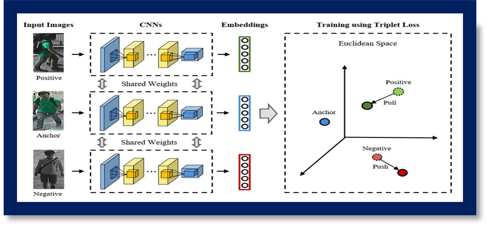

# COMSYS-Hackathon-5-2025
###  Task B: Face Verification
- **Objective:** 
    Build a **face verification system** that reliably matches distorted face images to their correct identities using metric learning, without relying on traditional classification approaches.

### 🌟 Key Challenges
- ✅ Handle **various distortions** (blur, noise, occlusions) in input images  
- ✅ Generalize to **unseen identities** during inference  
- ✅ Maintain high accuracy despite **low-quality references**

---

**Dataset Structure:**
```
Project/
│
├── Comys_Hackathon5/Task_B/
│       ├── train/
│       │      ├── ....jpg
│       │      └── ...
│       ├── val/
│             ├── ....jpg
│             └── ...        
├── models/
│      ├── Embedding_Seq.h5
│      └── TripletNetwork.h5
│
├── results/
│      ├── model_result.txt
│      └── model_graph.png
│
├── scripts/
│       ├── 01_triplet_network.py
│       ├── 02_embedding_model.py
│       └── 03_match_face.py
│
├── README.md
└── .gitattributes
```

## 🧠 Model Description: Triplet Network with a ResNet50 backbone for Face Verification

This Triplet Network leverages a ResNet50 backbone to learn discriminative embeddings through metric learning. The core objective is to minimize intra-class distances (pulling similar samples closer in the embedding space) while maximizing inter-class distances (pushing dissimilar samples apart). The model employs triplet loss, which trains on groups of three items(positive,negative,anchor).The optimization ensures that the anchor is always closer to the positive than to the negative by a defined margin :<div align="center">
                     **distance(anchor, positive) < distance(anchor, negative) + margin**. </div>
                     
<div align="center">
  
</div>

 **Model Goal**
- Learn a similarity-based system that embeds faces such that:
- Similar identities are **close in embedding space**
- Dissimilar faces are **far apart**
  
**Triplet Loss Implementation**

The standard triplet loss with a margin α:

<div align="center">
  
</div>

**Anchor (xa):** The reference image (red).

**Positive (x⁺):** A similar image of the same identity (green).

**Negative (x⁻):** An image of a different identity (blue).

### 🔍 **Why Triplet Loss?**


- **Handles Large Classes:**: Works well when there are thousands/millions of identities (e.g., in face recognition, where each person is a class).  
- **Focuses on Relative Similarity:**: Enforces that a face is closer to all other faces of the same person than to any face of a different person.  
- **Metric Learning**:  It directly optimizes the ["embedding space for distance-based comparisons "](https://www.researchgate.net/publication/357529033_Triplet_Loss)(unlike softmax classification).  


### 🔍 Why ResNet50?

- **Strong Feature Extraction**: Its deep residual layers capture hierarchical facial features (edges → textures → parts → whole face).  
- **Pretrained Advantage**: Pretrained on ImageNet, it already understands generic visual features, speeding up convergence.  
- **Balance of Speed and Accuracy**: Deeper than ["ResNet18"](https://www.researchgate.net/publication/348248500_ResNet_50) but more efficient than ResNet152, making it practical for deployment
 

### 🔍 How They Work Together

- ✔**Input**: Three face images (anchor, positive, negative). 
- ✔**ResNet50**:  Extracts features for each face.  
- ✔ **Embedding Layer**:  Maps features to a low-dimensional space (e.g., 128-D).  
- ✔ **Triplet Loss**:Computes distances and updates the model to satisfy:d(A,P)+α<d(A,N)
                       where : α is a margin (e.g., 0.2). 

### 🛠 Core Architecture
The twin networks (CNNs) encode input face images into high-dimensional embedding vectors using a shared backbone.These embeddings are then compared using Euclidean distance to determine similarity:
<div align="center">
  
  <p>Metric learning with Triplet Loss: Embeddings from shared-weight CNNs are adjusted to cluster similar (anchor/positive) and separate dissimilar (anchor/negative) samples</p>
  
</div>

### 🔄 Verification Workflow
**1. Preprocessing**
- Input: Two face images (Image A and Image B)
- Steps:
  - Face detection & alignment (MTCNN recommended)
  - Resize to `224×224` (ResNet standard input)
  - Normalize pixel values

**2. Feature Extraction**
```
# Pseudocode
embedding_a = resnet50(Image_A)  
embedding_b = resnet50(Image_B)  

1. Two face images are passed through the Triplet Network.
2. Each branch (with shared weights) generates a feature embedding.
3. A distance metric (e.g., Euclidean distance) computes the similarity between embeddings.
4. The result is compared against a predefined **threshold**:
   - If distance < threshold → ✅ Same Person
   - If distance ≥ threshold → ❌ Different Person
```
### 🖼️ Visualizing Training Triplets

Below is a sample visualization of the triplet structure used in training the Triplet Network:


<div  align="center"> Anchor-positive pairs (same class) vs. anchor-negative pairs (different classes) for metric learning</div>

- **Anchor**: The reference face image.
- **Positive**: A different image of the *same person* as the anchor.
- **Negative**: An image of a *different person* from the anchor.

This setup enables the model to learn embeddings where:
- Distance(anchor, positive) → **small**
- Distance(anchor, negative) → **large**

Such training ensures that the model can effectively distinguish between similar and dissimilar faces using a distance threshold.

### ⚙️ Model Specifications
| Parameter          | Value                          |
|--------------------|--------------------------------|
| Input Size         | 100×100 RGB                    |
| Base Model         | Custom CNN (4 Conv Blocks)     |
| Embedding Size     | 4096-D (sigmoid-activated)     |
| Loss Function      | Contrastive Loss               |
| Distance Metric    | Euclidean Distance             |

### Hardware Requirements

| Hardware       | Configuration                | Training Time Estimate | Notes                          |
|----------------|------------------------------|------------------------|--------------------------------|
| **High-End GPU** | NVIDIA RTX 3090 (24GB VRAM)  | ~2 hours               | Recommended for full batch size |
| **Mid-Range GPU** | NVIDIA RTX 2080 (8GB VRAM)   | ~3-4 hours            | Reduce batch size to 16        |
| **CPU Only**    | Modern 8-core CPU            | 5-6 hours             | Use batch size 8-12            |
| **Cloud**       | Google Colab Pro (T4/V100)   | 1.5-3 hours           | Free tier may have limitations |

**Notes:**
- Batch size: 32 recommended for GPUs, reduce for lower VRAM
- Training times based on 50k samples dataset
- SSD storage recommended for faster data loading

### 🏆📈  Performance Metrics
| Metric                   | Value  |
|--------------------------|--------|
| Test Accuracy            | ~97%   |
| precision                | 0.9729 |
| Recall                   | 0.9841 |
| F1-Score                 |0.9785  |
|Threshold                 |0.945   |
|micro-averaged F1-score   |0.9785  |

  ✅ Our trained Triplet Network with a ResNet50 backbone achieved an impressive ~97% verification accuracy on the validation/test set.

> 📌 Note: This high accuracy underscores the effectiveness of Triplet Networks in face verification tasks, especially when using embedding-based similarity with well-curated datasets.
>
## How to Reproduce the Results using  Triplet Network for Face Matching 

**1. Install Requirements**
```
# Create and activate virtual environment (recommended)
python -m venv triplet_env
source triplet_env/bin/activate  # Linux/Mac
.\triplet_env\Scripts\activate  # Windows
```
**2. Install dependencies**
```
pip install tensorflow scikit-learn matplotlib tqdm numpy
```
**3. Dataset Preparation**

**Prepare Your Data**

1. Each identity should have:

2. Original images in their folder

3. Variants (distortions) in a subfolder named distortion

```
Directory Structure  
        Comys_Hackathon5/
        └── Task_B/
            ├── train/
            │   ├── person_1/
            │   │   ├── image1.jpg
            │   │   ├── distortion/
            │   │   │   ├── distorted1.jpg  # Same person, different conditions
            │   ├── person_2/
            │   │   ├── image1.jpg
            │   │   ├── distortion/
            │   │   │   ├── distorted1.jpg
            └── val/  # Same structure as train
```
**4.🏋️ Training the Model**
- Run Training Script
 ```
       python train_triplet.py
 ```
- Files Generated
 ```  
    TripletNetwork.h5 (Full triplet model)

    Embedding_Seq.h5 (Embedding model)

    triplet_training_loss.png (Training curves)
```
### 5.📊 Evaluation

**📊 Threshold Tuning**

The evaluation script automatically computes the optimal verification threshold:

| Metric      | Value   | Description                          |
|-------------|---------|--------------------------------------|
| **Threshold** | 0.97    | Optimal decision boundary            |
| Accuracy    | 93.20%  | Overall correct predictions          |
| Precision   | 97.29%  | True positives / (True + False pos)  |
| Recall      | 98.41%  | True positives / All actual positives|
| F1 Score    | 97.85%  | Harmonic mean of precision & recall  |

✅ **Recommended threshold:** `0.97` for best balanced performance
    
**Manual Verification**

```
    python Script/03_Match_face.py \
        --reference "050_frontal_foggy.jpg" \
        --test "050_frontal_rainy.jpg" \
        
```

## Output:

**✅ MATCH: Same identity**


## 🤝 Acknowledgements

Developed by [AI-dentifiers](https://github.com/khushi04-sharma/Comys_Hackathon5_2025_Task_B) and contributor.  
For academic/educational use only.


## Contact:
For inquiries about permitted uses or collaborations, please contact: [dollysharma12.ab@gmail.com]


